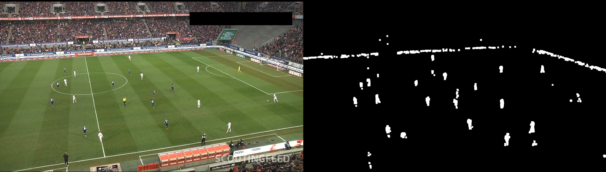

## **Akışkan Video Segmentasyonu ve Hareket Tespiti (Moving Object Segmentation)**

Bu depo, Lineer Cebir dersi proje gereksinimleri kapsamında; videodaki hareketli nesnelerin (futbol topu ve oyuncular) akışkan bir video üzerinden segmentasyonu amacıyla geliştirilmiş kodları ve sonuçları içermektedir.

## 📌 **Proje Özeti**

Projede, futbol maçına ait ardışık görüntü kareleri kullanılarak, hareketli nesnelerin arka plandan (saha ve tribün) ayrıştırılması işlemi gerçekleştirilmiştir. İşlemler Google Colab ortamında, Python dili kullanılarak yapılmış olup, temelinde matris farkı hesaplamaları ve morfolojik görüntü işleme teknikleri yatmaktadır.

## 🛠 Kullanılan Teknolojiler ve Parametreler

**Platform:** Google Colab (T4 GPU Hızlandırıcısı)

**Yöntem:** Arka Plan Çıkarma (MOG2 - Mixture of Gaussians)

**Kütüphaneler:** OpenCV, NumPy

Proje yönergesinde istenen spesifik parametreler model içerisine şu şekilde entegre edilmiştir:

**1.Kanal Boyu (Channel Size):** Görüntüler $M \\times N \\times 3$ boyutundaki RGB matrislerinden, hesaplama maliyetini düşürmek ve segmentasyonu netleştirmek adına tek kanallı (Grayscale) matrislere dönüştürülmüştür.

**2.Threshold / Eşik Değeri (0.30):** Matris çıkarma işlemi sonrası elde edilen fark matrisindeki değerler, $0.30$ eşik değerine (threshold) göre filtrelenmiştir. Bu sayede eşik değerinin altındaki durağan pikseller sıfırlanarak (siyah), sadece hareketli pikseller ikili (binary) maskeye dönüştürülmüştür.

**3.Kernel Boyutu (7x7):** Elde edilen segmentasyon maskesi üzerindeki taraftar ve ışık gürültülerini (noise) temizlemek amacıyla $7 \\times 7$ boyutunda bir birim matris (np.ones) kullanılarak Morfolojik Genişletme (Dilation) işlemi uygulanmıştır. Bu işlem futbolcu ve topun maske üzerinde daha belirgin (beyaz) görünmesini sağlamıştır.Batch Size / FPS: Video akışı, saniyede 10 kare (10 FPS) hızında işlenerek "batch" mantığıyla kare kare (frame-by-frame) analiz edilmiştir.

## 📐 Lineer Cebir Yaklaşımı

Bu projede her video karesi, $M \\times N$ boyutlarında birer matris dizisi olarak ele alınmıştır. Segmentasyon işlemi, ardışık iki matris arasındaki mutlak farkın ($|A - B|$) hesaplanması prensibine dayanır. Hareketin gerçekleşmediği alanlarda fark matrisi sıfıra yaklaşırken (sıfır matrisi), hareketin olduğu koordinatlarda değerler yükselir ve bu pikseller maskeleme yöntemiyle ayrıştırılır.

## 📂 Dosya Yapısı

main.py : Modelin çalıştığı, eşikleme ve morfolojik işlemlerin yapıldığı ana Python kodu.

futbol\_segmentasyon\_final.mp4 : Parametrelerin uygulanmasıyla elde edilen, arka planın siyah (sıfır matrisi) olduğu ve sadece hareketli nesnelerin beyaz tespit edildiği çıktı videosu.

